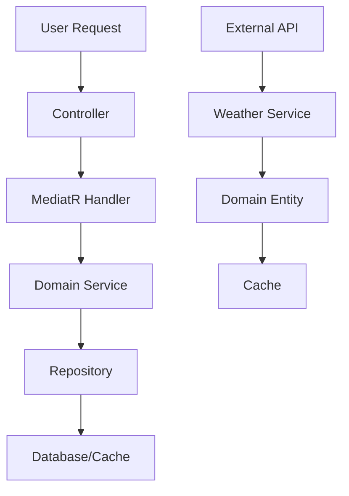

# System Architecture & Patterns

## Clean Architecture Overview
```
┌─────────────────────────────────────────┐
│                Web/API                  │  ← Controllers, Views, DTOs
├─────────────────────────────────────────┤
│            Application Layer            │  ← Use Cases, Commands, Queries
├─────────────────────────────────────────┤
│             Domain Layer                │  ← Entities, Value Objects, Domain Services
├─────────────────────────────────────────┤
│          Infrastructure Layer           │  ← Data Access, External APIs, Caching
└─────────────────────────────────────────┘
```

## Project Structure
```
WeatherForecast.sln
├── src/
│   ├── WeatherForecast.Domain/           # Core business logic
│   ├── WeatherForecast.Application/      # Use cases và business workflows
│   ├── WeatherForecast.Infrastructure/   # Data access, external services
│   └── WeatherForecast.Web/             # MVC controllers, views, APIs
├── tests/
│   ├── WeatherForecast.Domain.Tests/
│   ├── WeatherForecast.Application.Tests/
│   ├── WeatherForecast.Infrastructure.Tests/
│   └── WeatherForecast.Web.Tests/
└── docker/
    ├── Dockerfile
    └── docker-compose.yml
```

## Key Design Patterns

### 1. CQRS (Command Query Responsibility Segregation)
- **Commands**: Thay đổi state (AddFavoriteCity, UpdateUserPreferences)
- **Queries**: Đọc dữ liệu (GetCurrentWeather, GetForecast)
- **MediatR**: Mediator pattern cho loose coupling

### 2. Repository Pattern
- **IWeatherRepository**: Abstract data access
- **ICityRepository**: Quản lý thành phố yêu thích
- **Unit of Work**: Quản lý transactions

### 3. Strategy Pattern
- **IWeatherProvider**: Cho phép switch giữa các weather APIs
- **ICacheStrategy**: Các strategy caching khác nhau

### 4. Factory Pattern
- **WeatherProviderFactory**: Tạo weather providers
- **NotificationFactory**: Tạo các loại thông báo

## Data Flow


## Dependency Injection Container
- **Services**: Weather services, notification services
- **Repositories**: Data access abstractions
- **Validators**: FluentValidation validators
- **AutoMapper**: Object mapping profiles
- **Caching**: Redis distributed cache
- **Logging**: Serilog configuration 