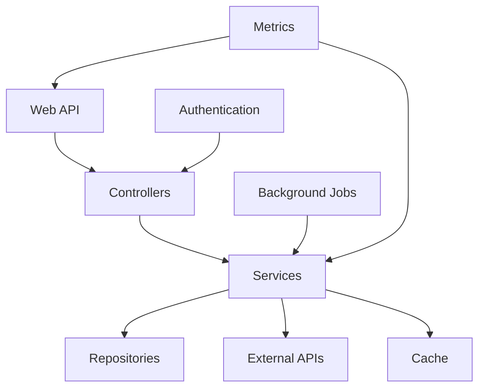

# System Patterns

## Architecture Patterns
1. Clean Architecture
   - Domain layer: Core business logic and entities
   - Application layer: Use cases and interfaces
   - Infrastructure layer: External services and implementations
   - Web layer: API controllers and middleware

2. Repository Pattern
   - Abstract data access
   - Interface-based design
   - Separation of concerns
   - Easy testing and mocking

3. Service Pattern
   - Business logic encapsulation
   - External service integration
   - Caching strategy
   - Error handling

## Design Patterns
1. Caching Strategy
   - Redis distributed cache
   - Cache invalidation
   - Background cache updates
   - Cache key management

2. Background Job Pattern
   - Hangfire job scheduling
   - Retry policies
   - Job monitoring
   - Error handling

3. Authentication Pattern
   - JWT token-based auth
   - Role-based access control
   - Secure endpoints
   - Token validation

4. Monitoring Pattern
   - Prometheus metrics
   - Health checks
   - Logging strategy
   - Error tracking

## Component Relationships

## Error Handling
1. Global Exception Handling
   - Middleware-based approach
   - Consistent error responses
   - Detailed logging
   - Error tracking

2. Retry Policies
   - Exponential backoff
   - Maximum retry attempts
   - Circuit breaker pattern
   - Error logging

## Security Patterns
1. Authentication
   - JWT token validation
   - Role-based authorization
   - Secure endpoints
   - Token management

2. Rate Limiting
   - Request throttling
   - IP-based limiting
   - User-based limiting
   - Configurable limits

## Monitoring Patterns
1. Metrics Collection
   - API call metrics
   - Performance metrics
   - Cache metrics
   - Error metrics

2. Health Checks
   - Service health
   - External API health
   - Cache health
   - Background job health

3. Logging Strategy
   - Structured logging
   - Log levels
   - Log aggregation
   - Error tracking